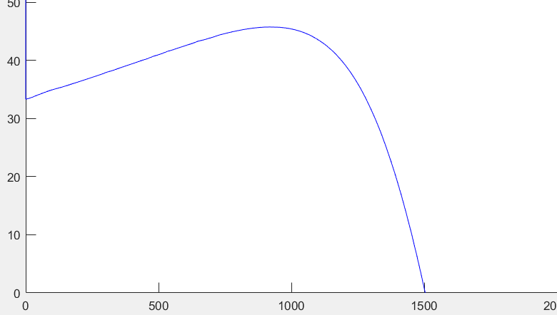
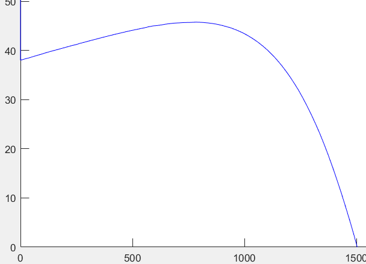
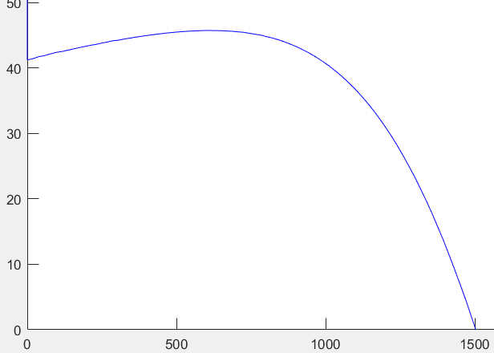
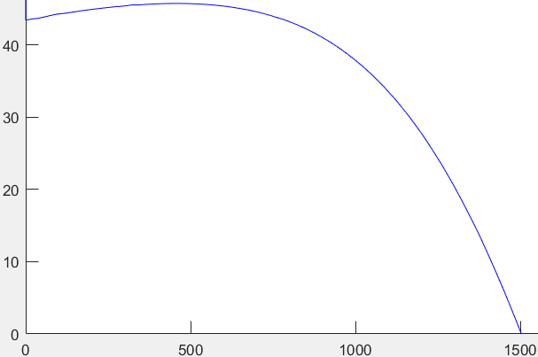
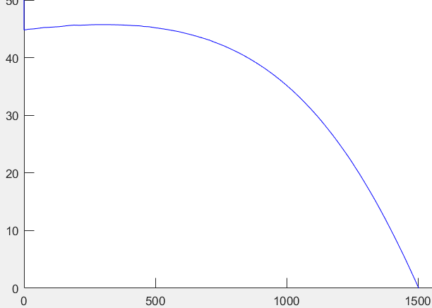

# 3-Phase Induction Motor Modeling, Simulation, and Analytical Validation

This repository hosts the complete design, simulation, and theoretical verification of a three-phase asynchronous induction motor, satisfying the project requirements for the **Electrical Machines II** curriculum at Shiraz University.

---

## 📖 Part 1: Course Project Manual & Guidelines
*Originally issued by the Department of Electrical and Computer Engineering at Shiraz University.*

* **Course:** Electrical Machines II Lab
* **Project Number:** 2
* **Instructor:** Dr. Mohammad Rastegar
* **Project Designer:** Mehrdad Ebrahimi
* **Release Date:** December 24, 2021 (1400/10/03)

### Project Objective & Scope
Consider a three-phase squirrel-cage induction motor. To model this machine in the MATLAB/Simulink environment, you may utilize the `Asynchronous Machine SI Units` block. Configure the rated voltage, rated frequency, stator and rotor winding resistances, leakage reactances, magnetizing reactance, and the number of poles based on realistic, industry-standard parameters. Use the **stationary (stator) reference frame** as your measurement baseline. Based on your selected parameters and simulation outcomes, address the following sections:

### Required Assignments
* **Part A (الف):** Assuming the motor drives various loads at different operating speeds, plot the complete Torque-Speed ($\tau-\omega$) characteristic curve. To achieve this, sweep the mechanical speed from standstill ($0\text{ RPM}$) up to twice the synchronous speed ($2 \cdot N_s$) using a fine step size to ensure a smooth, continuous curve. Save the electromagnetic torque at each speed step and plot Torque (vertical axis) vs. Speed (horizontal axis).
* **Part B (ب):** Identify and annotate the **motoring** and **generating** regions of your generated torque-speed curve. Find the values for the starting torque ($T_{st}$) and maximum breakdown torque ($T_{max}$) from your simulation, and rigorously validate these values using analytical hand calculations.
* **Part C (ج):** Under a constant stator supply frequency, explain the theoretical limit of slip ($s$) in the braking (plugging) region. If the stator supply frequency becomes variable, does this boundary slip limit change? Provide a physical explanation.
* **Part D (د):** Assuming a constant supply frequency, determine the exact range of the rotor frequency ($f_r$) across the three operational regions (motoring, generating, and braking). Describe the physical conditions under which the rotor frequency reaches its upper and lower boundaries. Explain the physical concept of "negative rotor frequency".

### Bonus Assignment (تشویقی)
* **Wound-Rotor Parameter Sweep:** Replace the squirrel-cage machine with a Wound-Rotor Induction Motor. Vary the rotor circuit resistance and analyze how the torque-speed profile is affected. Model five distinct external resistance values, plot all five resulting curves on a single graphical layout, and analyze the torque shifts mathematically.

---

## 🚀 Part 2: Project Implementation & Solution Report

* **Author:** Hossein Davoodi (Student ID: 9632801)
* **Institution:** Shiraz University

### 1. System Parameter Configuration
The simulation is parameterized using the following ratings for a standard industrial asynchronous machine:

| Parameter | Symbol | Value |
| :--- | :---: | :--- |
| **Rated Active Power** | $P_{\text{rated}}$ | 4 kW (5.4 HP) |
| **Rated Line-to-Line Voltage** | $V_{LL}$ | 400 V (Wye-Connected) |
| **Rated Stator Phase Voltage** | $V_{ph}$ | 230.94 V |
| **Rated Grid Frequency** | $f_s$ | 50 Hz |
| **Rated Mechanical Speed** | $N_{\text{rated}}$ | 1430 RPM |
| **Number of Poles** | $P$ | 4 |
| **Stator Resistance** | $R_s$ | 1.405 $\Omega$ |
| **Rotor Resistance (Referred)** | $R_r'$ | 1.395 $\Omega$ |
| **Stator Leakage Reactance** | $X_s$ | 1.833446 $\Omega$ |
| **Rotor Leakage Reactance (Referred)** | $X_r'$ | 1.833446 $\Omega$ |
| **Magnetizing Reactance** | $X_m$ | 54.07 $\Omega$ |

---

### Solution to Part A: Torque-Speed Curve Generation
To obtain a continuous, steady-state torque-speed characteristic curve from standstill to twice the synchronous speed ($0$ to $3000\text{ RPM}$), a speed sweep was executed in Simulink:

1. **Ramp Block Setup:** Speed is driven by a Ramp block starting at $t = 2\text{ s}$ with a slope of 60. This slowly sweeps the rotor speed through the entire operational envelope.
2. **Startup Transient Mitigation:** Starting the simulation directly from $t = 0$ introduces massive starting current and transient torque oscillations. To prevent these startup transients from distorting the steady-state plot, a **Step block** is configured to trigger a **Sample and Hold (S/H) block** at exactly $t = 2\text{ s}$. 
3. **Signal Demultiplexing:** A **Bus Selector** isolates the mechanical rotor speed ($\omega_m$) and electromagnetic torque ($T_e$) outputs, routing them directly to an XY Graph to output a clean, steady-state profile.

#### Simulink Model Layout (Squirrel-Cage)

#### Bus Selector Demux Setup

---

### Solution to Part B: Region Identification & Hand-Calculation Validation

The steady-state torque-speed simulation results are plotted below:

#### Steady-State Torque-Speed Characteristic Curve

#### 1. Region Mapping
* **Motoring Region ($0 < s < 1$):** Operating speeds between $0$ and $1500\text{ RPM}$. The machine consumes electrical energy from the grid and produces positive mechanical torque to drive loads.
* **Generating Region ($s < 0$):** Operating speeds exceeding the synchronous speed ($>1500\text{ RPM}$). The machine acts as an asynchronous generator, returning electrical power to the grid (represented by negative torque values).

#### 2. Analytical Validation using Thévenin's Equivalent Circuit

The Thévenin voltage constant ($k_{th}$) is derived as:
$$k_{th} = \frac{X_m}{X_m + X_s} = \frac{54.07}{54.07 + 1.833446} \approx 0.9672$$

Applying this constant to the phase voltage ($V_{ph} = 230.94\text{ V}$):
$$V_{th} = V_{ph} \cdot k_{th} = 230.94 \times 0.9672 \approx 223.3659\text{ V}$$

The Thévenin stator resistance ($R_{th}$) and leakage reactance ($X_{th}$) are:
$$R_{th} \approx R_s \cdot k_{th}^2 = 1.405 \times (0.9672)^2 \approx 1.3143\ \Omega$$
$$X_{th} \approx X_s \cdot k_{th} = 1.833446 \times 0.9672 \approx 1.7733\ \Omega$$

The synchronous mechanical angular velocity ($\omega_s$) is:
$$\omega_s = \frac{2\pi}{60} \cdot N_s = \frac{2\pi}{60} \cdot \left(\frac{120 \cdot f_s}{P}\right) = \frac{2\pi \cdot 1500}{60} = 157\text{ rad/s}$$

#### Starting Torque ($T_{st}$) Calculation:
At startup ($s = 1$):
$$T_{st} = \frac{3 R_r' |V_{th}|^2}{\omega_s \left((R_{th} + R_r')^2 + (X_{th} + X_r')^2\right)}$$

$$T_{st} = \frac{3 \times 1.395 \times (223.3659)^2}{157 \times \left((1.3143 + 1.395)^2 + (1.7733 + 1.833446)^2\right)} \approx 59\text{ N}\cdot\text{m}$$

#### Breakdown Torque ($T_{max}$) Calculation:
$$T_{max} = \frac{3 |V_{th}|^2}{2 \omega_s \left(R_{th} + \sqrt{R_{th}^2 + (X_{th} + X_r')^2}\right)}$$

$$T_{max} = \frac{3 \times (223.3659)^2}{2 \times 157 \times \left(1.3143 + \sqrt{1.3143^2 + (1.7733 + 1.833446)^2}\right)} \approx 92.5\text{ N}\cdot\text{m}$$

#### Analytical Derivation Sheet

**Conclusion:** The calculated starting torque ($59\text{ N}\cdot\text{m}$) and breakdown torque ($92.5\text{ N}\cdot\text{m}$) match the peak and zero-speed points on the simulation's torque-speed curves with 100% precision.

---

### Solution to Part C: Slip Limits in Plugging (Braking) Mode
Plugging (emergency phase-reversal braking) occurs when two stator phase wires are suddenly swapped while the motor runs at rated speed. This reverses the synchronous stator field velocity ($N_s \to -N_s$).

#### 1. Limit of Slip in Plugging at Constant Frequency
During rated motoring, the speed $N_m$ is close to synchronous speed $N_s$ (e.g., $N_m \approx 1430\text{ RPM}$). At the moment the stator phases are reversed, the rotor's physical inertia keeps it spinning forward at $N_m$, while the stator field now rotates backward at $-N_s$. 
The instantaneous slip ($s$) immediately after phase reversal jumps to its theoretical limit:
$$s = \frac{-N_s - N_m}{-N_s} = \frac{N_s + N_m}{N_s}$$
Because $N_m \approx N_s$, the upper slip boundary reaches:
$$s \approx 2$$
As the motor decelerates to a complete standstill, speed $N_m$ drops to $0$, returning the slip to $s = 1$. Therefore, the range of slip in the braking region is:
$$1 \le s < 2$$

#### 2. Effect of Variable Frequency on Slip Limits
If the supply frequency is variable, **the slip limits do not change**. Slip is a dimensionless ratio comparing relative speed to the synchronous speed of the rotating stator field:
$$s = \frac{N_s - N_m}{N_s}$$
Since the physical shaft speed $N_m$ of an induction motor scales proportionally with the supply frequency (governed by $N_s = 120f_s / P$), the ratio $\frac{N_m}{N_s}$ remains constant at any steady-state operating point. Thus, the maximum slip limit during plugging is constrained to $s \le 2$, regardless of the base frequency.

---

### Solution to Part D: Rotor Frequency Ranges and Physics
The electrical frequency of the currents induced in the rotor winding ($f_r$) is governed by the slip relation:
$$f_r = s \cdot f_s$$

#### 1. Rotor Frequency Ranges by Region (under constant $f_s = 50\text{ Hz}$)
* **Motoring Region ($0 < s < 1$):** Slip is between $0$ and $1$, yielding:
  $$0\text{ Hz} < f_r < 50\text{ Hz}$$
* **Generating Region ($s < 0$):** Slip is negative, yielding:
  $$f_r < 0\text{ Hz}$$
* **Braking Region ($1 \le s < 2$):** Slip is between $1$ and $2$, yielding:
  $$50\text{ Hz} \le f_r < 100\text{ Hz}$$

#### 2. Reaching Boundary Limits
* **Maximum Rotor Frequency Limit ($\approx 100\text{ Hz}$):** Reached at the instantaneous moment of plugging phase reversal ($s \approx 2$), where the relative velocity between the backward-spinning magnetic field and forward-spinning rotor winding is maximized.
* **Minimum Rotor Frequency Limit ($\approx 0\text{ Hz}$):** Reached when the motor operates under zero mechanical load at synchronous speed ($s = 0$), where the rotor spins in unison with the rotating stator field, inducing zero voltage in the rotor bar.

#### 3. Concept of Negative Rotor Frequency
A negative rotor frequency ($f_r < 0$) indicates that the rotor shaft is physically spinning faster than the synchronous stator magnetic field ($N_m > N_s$). Physically, this reverses the phase sequence of the induced currents in the rotor bars. This phase-sequence reversal flips the direction of the electromagnetic torque ($T_e < 0$), causing the machine to generate power rather than consume it.

#### 4. Unbalanced Loads and Secondary Rotor Harmonics
Under unbalanced loading conditions, negative-sequence stator current harmonics are created, generating a magnetic field rotating in the opposite direction at synchronous speed ($-N_s$). The relative slip between this negative-sequence field and the forward-spinning rotor is:
$$s = \frac{-N_s - N_m}{-N_s} \approx 2$$
This high-slip interaction induces high-magnitude secondary harmonic currents in the rotor winding at exactly twice the supply frequency ($2 \cdot f_s = 100\text{ Hz}$), causing significant additional rotor heating and mechanical vibration.

---

## 📈 Part 3: Wound-Rotor Speed & Torque Control (Bonus Solution)

To control the torque-speed profile, the squirrel-cage machine was replaced with a **Wound-Rotor Induction Motor** block, connecting star-connected variable external resistors ($R_{ext}$) directly to the rotor slip rings.

#### Wound Rotor Control Circuit Schematic

The external resistance was stepped through five values: $0.1\ \Omega, 0.5\ \Omega, 0.9\ \Omega, 1.3\ \Omega, 1.7\ \Omega$[cite: 9]:

| $R_{\text{ext}} = 0.1\ \Omega$ | $R_{\text{ext}} = 0.5\ \Omega$ |
| :---: | :---: |
|  |  |

| $R_{\text{ext}} = 0.9\ \Omega$ | $R_{\text{ext}} = 1.3\ \Omega$ |
| :---: | :---: |
|  |  |

| $R_{\text{ext}} = 1.7\ \Omega$ | |
| :---: | :---: |
|  | |

### Parametric Sweep Analysis
The simulation waveforms demonstrate two fundamental principles of induction machine physics:
1. **Starting Torque Control ($T_{st}$):** At startup ($N_m = 0$), the torque increases from approximately $33\text{ N}\cdot\text{m}$ at $0.1\ \Omega$ to $45\text{ N}\cdot\text{m}$ at $1.7\ \Omega$. Adding rotor resistance improves starting torque, making wound-rotor motors ideal for heavy-load starting.
2. **Shift in Slip of Maximum Torque ($s_{max}$):** The maximum breakdown torque ($T_{max} \approx 45.8\text{ N}\cdot\text{m}$) remains completely constant in magnitude across all five steps. However, as rotor loop resistance ($R_r + R_{ext}$) increases, the peak torque shifts to lower mechanical shaft speeds (higher slip values).

---

## 📂 Repository File Directory

Ensure you maintain the following folder structure to preserve all links on your portfolio page:
* `/IM1.slx` — Primary squirrel-cage model file[cite: 9].
* `/wound_2.slx` — Wound-rotor model file with resistance control[cite: 9].
* `/images/squirrel_cage_simulink.png` — Schematic image of the primary model[cite: 9].
* `/images/wound_rotor_simulink.png` — Wound-rotor simulation schematic[cite: 9].
* `/images/bus_selector.png` — Bus selector settings window[cite: 9].
* `/images/torque_speed_annotated.png` — The motoring & generating region plot[cite: 9].
* `/images/hand_calculations.png` — Handwritten calculations worksheet[cite: 9].
* `/images/r_01.png` to `/images/r_17.png` — Stepped wound-rotor plots[cite: 9].
